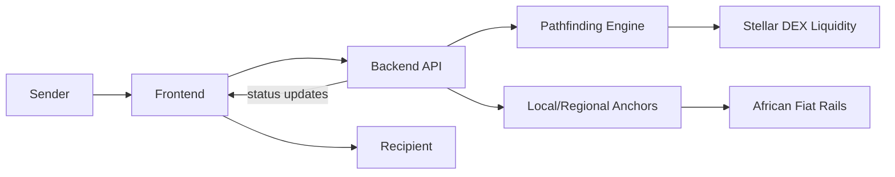

# AfriStar Pay

A Stellar-powered remittance infrastructure layer enabling instant, low-cost cross-border payments across Africa through intelligent pathfinding, anchor integrations, and decentralized exchange liquidity.

[](https://stellar.org)
[](#license)

## Table of Contents

- [Overview](#overview)
- [Problem It Solves](#problem-it-solves)
- [Key Features](#key-features)
- [Architecture](#architecture)
- [Tech Stack](#tech-stack)
- [Getting Started](#getting-started)
  - [Prerequisites](#prerequisites)
  - [Installation](#installation)
  - [Environment Variables](#environment-variables)
  - [Running Locally](#running-locally)
  - [Testing the API](#testing-the-api)
- [Project Structure](#project-structure)
- [Usage](#usage)
- [Contributing](#contributing)
- [Roadmap](#roadmap)
- [License](#license)
- [Acknowledgments](#acknowledgments)
- [Contact & Support](#contact--support)

## Overview

AfriStar Pay is a remittance infrastructure layer built on the [Stellar](https://stellar.org) network, purpose-built for cross-border payments across Africa. Rather than acting as a single consumer app, it functions as an underlying payments layer: it finds efficient routes between currencies, taps into Stellar's decentralized exchange for liquidity, and connects to regulated anchors so value can move between digital rails and local fiat currencies.

## Problem It Solves

Cross-border payments into, out of, and within Africa are often among the most expensive and slowest remittance corridors in the world. Senders frequently rely on layers of correspondent banks or informal operators, each adding cost, delay, and uncertainty, while many corridors lack deep, efficient currency liquidity, leading to poor exchange rates for the people who can least afford them.

AfriStar Pay is designed to address this by:

- Settling payments on the Stellar network in seconds rather than days, removing the multi-day delays typical of correspondent banking.
- Using intelligent pathfinding to route payments through the most efficient combination of assets, rather than forcing a single fixed corridor.
- Tapping into Stellar's built-in decentralized exchange for liquidity, helping payments get better effective rates even in corridors that are thin or underserved by traditional liquidity providers.
- Connecting to local and regional anchors so funds can convert between on-chain assets and the fiat currencies people actually use day to day.

## Key Features

- **Intelligent pathfinding** — automatically determines the most cost-effective route for converting and moving value between assets on the Stellar network.
- **Anchor integrations** — connects to anchors that bridge Stellar-based assets with local fiat currency for deposits and withdrawals.
- **Decentralized exchange liquidity** — sources liquidity directly from Stellar's built-in distributed exchange rather than depending solely on a single off-chain market maker.
- **Africa-focused remittance corridors** — designed around the specific needs of cross-border payments into, out of, and across African markets.
- **Postman collection included** — `AfristarPay.postman_collection.json` lets developers explore and test the API directly.

## Architecture

AfriStar Pay is organized as a `backend` infrastructure layer and a `frontend` client, following the same general shape as other Stellar remittance tools.



At a high level:

- **Frontend** — the client interface where senders initiate a transfer and recipients or senders can monitor its progress.
- **Backend** — exposes the API, runs pathfinding logic to find the optimal route across available assets, and manages communication with anchors.
- **Pathfinding Engine** — calculates the best sequence of asset conversions across the Stellar network for a given transfer.
- **Stellar DEX** — Stellar's built-in decentralized exchange, used as a source of liquidity when routing payments.
- **Anchors** — regulated entities that connect AfriStar Pay to local fiat currency rails across African markets.

> Note: this diagram and breakdown are inferred from the project's stated purpose and its `backend`/`frontend` folder structure, since the underlying source files weren't directly readable. Update this section to reflect actual modules, services, or data stores once the codebase is reviewed directly.

## Tech Stack

- **Network/Protocol:** Stellar (path payments, decentralized exchange, anchor protocols)
- **API testing:** Postman (collection included in the repo)

*(Add the specific language and framework details here — e.g. Node.js/TypeScript on the backend, the frontend framework in use — once confirmed against the `package.json` files in each folder.)*

## Getting Started

### Prerequisites

Before you begin, make sure you have:

- [Node.js](https://nodejs.org/) (LTS recommended) and npm or yarn
- A Stellar account/keypair for testing (use [Friendbot](https://friendbot.stellar.org/) to fund a testnet account)
- Access credentials or sandbox access for any anchors you intend to test against
- [Postman](https://www.postman.com/) (optional, for exploring the included API collection)

### Installation

```bash
# Clone the repository
git clone https://github.com/ellaevans2323-pixel/AfriStar-Pay.git
cd AfriStar-Pay

# Install backend dependencies
cd backend
npm install

# Install frontend dependencies
cd ../frontend
npm install
```

### Environment Variables

Create a `.env` file in `backend/` (and `frontend/` if applicable) with values such as:

```bash
# Stellar network configuration
STELLAR_NETWORK=testnet          # or "public" for mainnet
HORIZON_URL=https://horizon-testnet.stellar.org

# Anchor configuration
ANCHOR_BASE_URL=
ANCHOR_API_KEY=

# Backend server
PORT=4000
```

> These are inferred from the project's stated functionality. Replace with the actual variable names used in the codebase, and consider adding an `.env.example` so contributors don't have to guess.

### Running Locally

```bash
# Start the backend
cd backend
npm run dev

# In a separate terminal, start the frontend
cd frontend
npm run dev
```

Once both are running, the frontend should be reachable locally (commonly `http://localhost:3000`), and it will talk to the backend API.

### Testing the API

Import `AfristarPay.postman_collection.json` into Postman to explore and test the available endpoints directly, without needing the frontend running.

## Project Structure

```
AfriStar-Pay/
├── backend/                              # API server: pathfinding, anchor integration, liquidity routing
├── frontend/                             # Client application for senders and recipients
└── AfristarPay.postman_collection.json   # Ready-made Postman collection for API testing
```

## Usage

1. Connect or fund a Stellar account for the sender.
2. Initiate a transfer through the frontend, specifying the source currency, destination currency, and recipient.
3. AfriStar Pay's pathfinding engine determines the most efficient route, drawing on Stellar DEX liquidity where useful.
4. Anchors handle conversion between on-chain assets and local fiat currency at either end of the transfer.
5. Track the transfer status until it settles with the recipient.

## Contributing

Contributions are welcome. To get started:

1. Fork the repository and clone your fork locally.
2. Create a feature branch off `main`:
   ```bash
   git checkout -b feature/your-feature-name
   ```
3. Make your changes, following the existing code style in `backend/` and `frontend/`.
4. Commit using clear, descriptive messages (e.g. `fix: handle anchor timeout errors`, `feat: improve pathfinding for thin liquidity corridors`).
5. Push your branch and open a pull request against `main`, describing what changed and why.
6. Keep PRs small and focused where possible — it makes review faster and merges smoother.

If you find a bug or have a feature request, please open an [issue](https://github.com/ellaevans2323-pixel/AfriStar-Pay/issues) with steps to reproduce, expected vs actual behavior, and relevant environment details.

## Roadmap

No public roadmap has been published yet. Check the [Issues](https://github.com/ellaevans2323-pixel/AfriStar-Pay/issues) tab for planned work and open feature requests.

## License

No license file is currently present in this repository. Until one is added, the default of full copyright (all rights reserved) applies, meaning others technically cannot legally use, modify, or distribute this code. Consider adding an [MIT](https://choosealicense.com/licenses/mit/) or other open-source license if you intend for others to use or contribute to this project.

## Acknowledgments

- Built on the [Stellar](https://stellar.org) network and its open-source SDKs and decentralized exchange.
- Relies on the broader ecosystem of Stellar anchors enabling local fiat on/off ramps across African markets.

## Contact & Support

For questions, bug reports, or feature requests, please open an issue on the [GitHub repository](https://github.com/ellaevans2323-pixel/AfriStar-Pay/issues).
